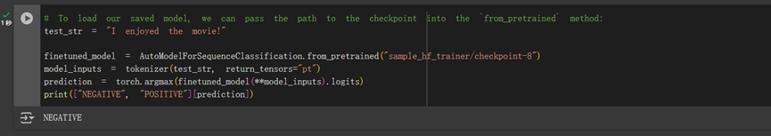

# pytorch tutorial notebook

# transformers notebook

# Using LoRA instead of full finetuning
## install

## setting

## output

AutoModelForCausalLM 和 OPTForCausalLM : 加載語言模型。

AutoTokenizer : 加載分詞器。

PeftConfig 和 LoraConfig : 用於配置和應用 LoRA adapter。

流程:
1. 使用 AutoModelForCausalLM 從 Hugging Face Hub 上加載 model_id 對應的預訓練模型。
2. 創建一個 LoRA adapter 配置 lora_config，並設定參數。
3. 使用 add_adapter 將配置好的 LoRA adapter 添加到模型中。
4. 使用 enable_adapters 方法啟用模型中的 adapter。
5. 定義了測試文本並設定輸出參數，再產生輸出字串。
